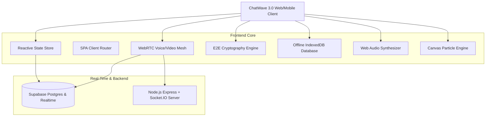

# ChatWave 3.0 Enterprise Architecture & Technical Specification

ChatWave 3.0 is a real-time, highly interactive, production-grade communication and collaboration platform designed for instant messaging, HD WebRTC calling, collaborative whiteboards, in-chat mini-apps, and zero-knowledge cryptographic privacy.

---

## 1. High-Level Architecture

---

## 2. Core Modules Breakdown

### 2.1 State Management (`src/core/StateStore.js`)
- **Pattern**: Central reactive event-driven state store with time-travel snapshots (undo/redo) and local storage persistence middleware.
- **Key Stores**: `currentUser`, `activeChatId`, `messages`, `users`, `groups`, `channels`, `stories`, `callState`, `whiteboardState`, `activeMiniApp`, `vaultStats`.

### 2.2 End-to-End Cryptography (`src/core/CryptoEngine.js`)
- **Key Exchange**: Elliptic Curve Diffie-Hellman (ECDH) over Curve P-256 using standard Web Cryptography API.
- **Symmetric Cipher**: AES-GCM 256-bit with 96-bit random initialization vectors (IVs) per message.
- **Key Derivation**: PBKDF2 with SHA-256, 100,000 iterations for password-derived vault credentials.

### 2.3 WebRTC Voice & Video Engine (`src/core/WebRTCManager.js`)
- **Mesh Topology**: 1-on-1 and multi-party peer connections with automatic STUN server failover.
- **Audio Processing**: Real-time Web Audio API FFT frequency analyzer for active speaker detection, noise suppression, and gain normalization.
- **Display Media**: Real-time screen sharing with dynamic track replacement without renegotiation dropouts.

### 2.4 Procedural Audio Synthesizer (`src/core/SoundSynthesizer.js`)
- Uses HTML5 Web Audio API oscillator nodes (sine, triangle, sawtooth) and gain envelopes to generate rich UI feedback sounds (chimes, pops, laser zaps, victory melodies, ringtones) with zero external audio assets.

### 2.5 In-Chat Mini-Apps & Games (`src/components/MiniApps/`)
- **Chess**: Complete engine with checkmate/stalemate detection and move history.
- **Tic-Tac-Toe**: Turn-based grid with win streak tracking and celebration confetti.
- **Wordle**: 5-letter word puzzle with green/yellow letter state tracking.
- **2048**: Matrix sliding tile game with smooth swipe controls and high scores.
- **Trivia Quiz**: Multi-category timer battle with score multiplier.
- **Code Playground**: In-browser live preview sandbox with console logger.
